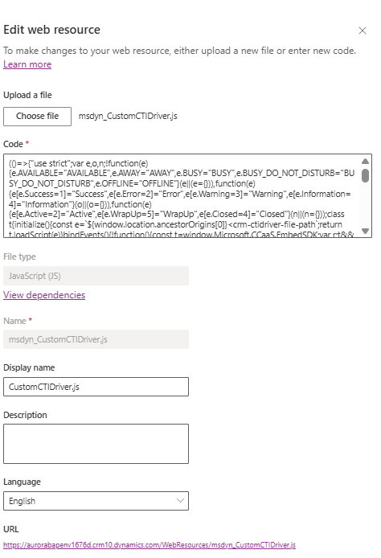
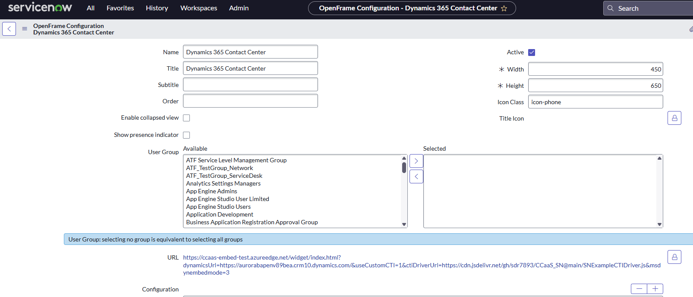

[//]: # "Copyright (c) Microsoft Corporation."
[//]: # "Licensed under the MIT License."

# Project

The Microsoft Dynamics 365 Contact Center is transforming customer engagement through Generative AI technology across various communication channels. It serves as an Copilot-first contact center as a service (CCaaS) solution compatible with preferred CRMs or third-party (3P) software. This add-on enables customers to leverage Dynamics 365 Contact Center along with AI functionalities within their preferred CRM system.

Built upon the Microsoft Azure, Power Platform, and core Dynamics 365 infrastructure, Dynamics 365 Contact Center extends its capabilities by seamlessly integrating CCaaS and AI features with existing 3P solutions. Agents have the flexibility to utilize the add-on in either Embedded mode, where the 3P CRM serves as the primary user experience (UX) with CCaaS/AI functionalities embedded, or Standalone mode, where Dynamics 365 Contact Center plus AI capabilities take precedence while maintaining connectivity with 3P CRM data.

# Prerequisites
1. [Set up D365 Contact Center embedded experience](https://learn.microsoft.com/en-us/dynamics365/contact-center/administer/set-up-embedded-experience)
2. Install Node [latest version](https://nodejs.org/en/download/package-manager)
3. git clone `https://github.com/microsoft/dynamics-365-contact-center.git`

# CTIDriver Setup

The CTI driver serves as a bridge between the Microsoft Omnichannel Add-on and Salesforce CRM, allowing for the integration of telephony features into the CRM environment.


## CTIDriver Extension for Salesforce and ServiceNow

### Common CTI Driver Configuration

**IMPORTANT NOTICE:** The external URL method for loading CTI drivers (Approach 2) is deprecated and will be removed on September 19, 2025. Please use the Web Resource approach (Approach 1) for all new implementations and migrate existing implementations immediately.

Before proceeding with platform-specific setup, understand the approaches available for configuring custom CTI drivers using the `useCustomCTI` flag:

#### **Approach 1: Web Resource (Recommended)**

This is the preferred and secure method for loading custom CTI drivers.

a. **Upload Custom CTI Driver to Web Resource:**

- Search for **web resource** under Default solutions in Dynamics 365
- Search for: `msdyn_CustomCTIDriver.js`
- Display name: "CustomCTIDriver.js"
- Click on `msdyn_CustomCTIDriver.js` to modify the JS file
- Replace the content with your compiled CTI driver file content (e.g., `dist/SFExampleCTIDriver.js` or `dist/SNExampleCTIDriver.js`) and **save and publish**.

   

   

b. **Use the CCaaS URL with Web Resource:**

   ```url
   https://<example-ccaas-domain>/widget/index.html?dynamicsUrl=https://<dynamics-environment>.crm.dynamics.com&useCustomCTI=1&msdynembedmode=3
   ```

**Note:** To verify web resource loading, check browser console for the element:

```javascript
document.getElementById("InlineCustomCTIDriver")
```

#### **Approach 2: External URL (DEPRECATED - Will be removed September 19, 2025)**

**This method is deprecated and will be removed in the 8.3 train release. Please migrate to the Web Resource approach (Approach 1) immediately.**

a. **Configure App Setting in Dynamics 365:**
      - Set `msdyn_enableCustomCTIFromWebresource` to **"No"** in Setting definitions

b. **Host the compiled file externally:**

- Host your compiled CTI driver file on a CDN or any publicly accessible URL
- Use the CCaaS URL with external CTI driver:

   ```url
   https://<example-ccaas-domain>/widget/index.html?dynamicsUrl=https://<dynamics-environment>.crm.dynamics.com&useCustomCTI=1&ctiDriverUrl=<CDN-url>&msdynembedmode=3
   ```

#### **Approach 3: Default CTI Driver**

Use the built-in default CTI driver without any custom implementation:

1. Set `useCustomCTI=0` in the query parameter
2. Use the following URL format:

   ```url
   https://ccaas-embed-test.azureedge.net/widget/index.html?dynamicsUrl=https://example.crm10.dynamics.com/&useCustomCTI=0&msdynembedmode=3
   ```

3. The system will automatically load the default CTI driver based on the environment

**Note:** Default CTI driver ignores any `ctiDriverUrl` parameter when `useCustomCTI=0`

#### **Important Behavior Notes:**

** Key Point:** To use ANY custom CTI driver (either web resource or external URL), you MUST include `useCustomCTI=1` in the URL.
**When `useCustomCTI` parameter is missing from URL:**

- The system defaults to `useCustomCTI=0` behavior
- System attempts to load default CTI driver for the environment
- Both `ctiDriverUrl` parameter and web resource are **ignored**

#### **CTI Driver Configuration Matrix:**

| useCustomCTI Parameter | App Setting | Expected Output | Example URL |
|------------------------|-------------------|-----------------|-------------|
| `useCustomCTI=1` | TRUE | Gets script from web resource (recommended) | `https://ccaas-embed-test.azureedge.net/widget/index.html?dynamicsUrl=https://example.crm10.dynamics.com/&useCustomCTI=1&msdynembedmode=3` |
| `useCustomCTI=1` (deprecated) | FALSE | Gets script from ctiDriverUrl parameter | `https://ccaas-embed-test.azureedge.net/widget/index.html?dynamicsUrl=https://example.crm10.dynamics.com/&useCustomCTI=1&ctiDriverUrl=https://your-cdn-url.com/js/YourCTIDriver.js&msdynembedmode=3` |
| `useCustomCTI=0` | Ignored | Uses default CTI driver (ignores ctiDriverUrl and web resource) | `https://ccaas-embed-test.azureedge.net/widget/index.html?dynamicsUrl=https://example.crm10.dynamics.com/&useCustomCTI=0&msdynembedmode=3` |

**example-ccaas-domain**: `https://ccaas-embed-prod.azureedge.net`

---

### Salesforce Extension

1. Navigate to `/samples/SFExampleCTIDriver`

2. Run command `npm install`

3. Open the file `/samples/SFExampleCTIDriver/src/SFExampleCTIDriver.ts`

4. Implement your desired functionality within any of the methods provided by the ICTIDriver interface.
    Refer to the [Salesforce OpenCTI Methods Documentation](https://developer.salesforce.com/docs/atlas.en-us.api_cti.meta/api_cti/sforce_api_cti_methods_intro_lightning.htm) for available methods and their usage.

5. Run command `npm run build`, dist/SFExampleCTIDriver.js file will get generated inside /SFExampleCTIDriver folder

6. **Configure Custom CTI Driver:** Follow the web resource approach (Approach 1) described in the [Common CTI Driver Configuration](#common-cti-driver-configuration) section above. Upload the `dist/SFExampleCTIDriver.js` file to the web resource.

7. Update the Salesforce Call center definition file (imported in prerequisite) by replacing the URL with the one generated in Step 6 based on your chosen approach.

   

8. Your Salesforce Extension integration is now complete and ready to use.

### ServiceNow Extension

1. Navigate to `/samples/SNExampleCTIDriver`

2. Run command `npm install`

3. Open the file `/samples/SNExampleCTIDriver/src/SNExampleCTIDriver.ts`

4. Implement your desired functionality within any of the methods provided by the ICTIDriver interface.
    Refer to the [ServiceNow OpenFrame Methods Documentation](https://developer.servicenow.com/dev.do#!/reference/api/washingtondc/client/c_openFrameAPI) for available methods and their usage.

5. Run command `npm run build`, dist/SNExampleCTIDriver.js file will get generated inside /SNExampleCTIDriver folder

6. **Configure Custom CTI Driver:** Follow the web resource approach (Approach 1) described in the [Common CTI Driver Configuration](#common-cti-driver-configuration) section above. Upload the `dist/SNExampleCTIDriver.js` file to the web resource.

7. Add the URL generated in Step 6 (based on your chosen approach) to the respective OpenFrame Configuration as shown in the screenshot below:

   **Url to the list of OpenFrame Configuration:** `https://<ServiceNow-domain>/now/nav/ui/classic/params/target/sn_openframe_configuration_list.do`

   

8. Your ServiceNow Extension integration is now complete and ready to use.


[ServiceNow setup Document](./documentation/ServiceNowSetup.md)

## CTIDriver Implementation for Generic CRM

### Configuration

1. Navigate to `samples/GenericExampleCTIDriver`.

2. Run `npm install` to install the project dependencies.

3. Navigate to `GenericExampleCTIDriver/src/GenericExampleCTIDriver.ts`.

4. Implement the methods defined in `ICTIInterface` according to your CRM requirements.

5. Run `npm run build` to compile the project.

6. **Configure Custom CTI Driver:**
   - **Recommended:** Follow the web resource approach (Approach 1) described in the [Common CTI Driver Configuration](#common-cti-driver-configuration) section above. Upload the compiled `dist/GenericExampleCTIDriver.js` file to the web resource.
   - **Legacy (Deprecated):** Host the compiled file on a CDN and include the CDN URL as a query parameter in the CCaaS URL:
     `https://<example-ccaas-domain>/widget/index.html?dynamicsUrl=https://<dynamics-environment>.crm.dynamics.com&ctiDriverUrl=<CDN-url>`

     Note: This method will be removed on September 19, 2025. Please migrate to the web resource approach.

   **example-ccaas-domain**: `https://ccaas-embed-prod.azureedge.net`

7. Incorporate this URL into the phone/softphone settings of your CRM.

### Communication between Generic CRM and CTIDriver

1. Use `window.postMessage` to communicate from CTIDriver to Generic CRM.
```typescript
embedSDK.conversation.onConversationLoaded((conversationData: IConversationLoadedEventData) => {
    console.log("Embed SDK Conversation Loaded", conversationData);
    window.parent.postMessage(conversationData, "*");
    presenceAPIs(embedSDK);
    getFocusedConversationId(embedSDK);
});
```

2. Use `document.getElementById("iframeId").contentWindow.postMessage` to communicate from Generic CRM to CTIDriver.
```typescript
// code required to send message on Generic CRM side
document.getElementById("iframeId").contentWindow.postMessage(JSON.stringify({messageType:"clickToDial", messageData: {number: 8208654321}}),"*");

// code required to listen for message event on CTIDriver side
window.addEventListener("message", (event) => {
    const {messageType, messageData} = JSON.parse(event.data);
    if (messageType && messageType === "clickToDial") {
        const clickDialPayload = {
            number: messageData.number
        };

        callbackFunction(clickDialPayload);
    }
})
```

# CCaaS SDK APIs

Refer to the <a href="./documentation/CCaaS%20SDK%20APIs/README.md">CCaaS SDK README</a> for details on available APIs and how to integrate them.
